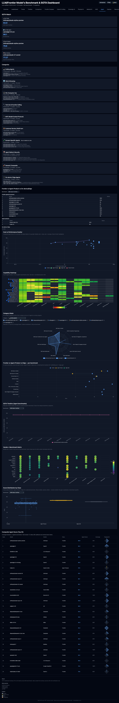

# SOTA
LLM benchmark &amp; SOTA
<!-- BADGES:START -->
   
<!-- BADGES:END -->

**Live site:** https://hollobit.github.io/SOTA/

## Dashboard tabs (14)

Overview · Leaderboard · Trends · Timeline · Comparison · Frontier Compare · Cyber & Coding · Sovereign AI · Physical AI · Medical AI · AI4S · **Agent** *(new — 10 sub-categories + 8 graphical widgets)* · Explorer · Resources · Changelog

## Agent Menu (2026-05-08)

Newest tab. 10 agent sub-categories (general agents, coding agents, browser agents, computer-use, tool-use, planning, multi-agent, on-device, voice, vision) plus 8 graphical widgets driven by ECharts:

- 💰 **Cost vs Performance Scatter** — log-scale $/M-token vs benchmark score, Pareto frontier highlighted
- 🔥 **Capability Heatmap** — top 20 models × 12 benchmarks, normalized 0–1
- 🕸️ **Category Radar** — per-model multi-axis radar across 10 agent categories
- ⚖️ **Frontier vs Agent-Product vs Edge dot plot** — three-tier deployment comparison
- ⏱️ **SOTA Timeline** — month-by-month best-score progression
- 📊 **Vendor × Benchmark bubble matrix** — coverage and leadership at a glance
- 🧬 **Capability Fingerprint mini-radar** — compact per-model signature
- 📈 **Score Distribution Violin** — spread of model scores per benchmark



## Development setup

```bash
# Install Python dependencies
pip install -e '.[dev]'

# Install pre-commit hooks (first-time setup only)
pip install pre-commit
pre-commit install

# Run all tests
make test

# Validate enrichment YAML against schema
python3 scripts/validate_enrichment.py

# Refresh enrichment coverage badge
python3 scripts/update_coverage_badge.py
```

## Adding a new model

1. Cite a primary source URL where the model name + benchmark name + value all appear together
2. Add scores to `resource/zzz_<your_topic>_2026_MM_DD_scores.json`
3. (Frontier-30 only) Add enrichment to `config/model_enrichment.yaml`
4. Run `make load && make export`
5. Verify dashboard at localhost: `cd dashboard && python3 -m http.server 8765`
6. Open PR — the new-model checklist will guide you

## CI workflow

Workflows run on `main` but operate against the `ops` branch (checkout uses `ref: ops`, push targets `origin HEAD:ops`). `main` is docs-only — `HISTORY.md`, `README.md`, `LICENSE`. All code, data, and dashboard changes land on `ops` and deploy via GitHub Pages.

## Project structure

- `cyber/` — Python pipeline (loader, exporter, schema)
- `scripts/` — Build-time scripts (HF fetch, enrichment auto-extract, badge)
- `config/` — YAML configs (seed sources, model enrichment, schema)
- `dashboard/` — Static dashboard (HTML + JS + ECharts) deployed to GitHub Pages
- `resource/` — Seed JSON files (model + benchmark + score data)
- `data/export/` — Build artifacts consumed by the dashboard
- `tests/` — pytest unit tests (Python)
- `dashboard/js/__tests__/` — vanilla node assert tests (JavaScript)
- `dashboard/tests/` — Playwright E2E tests
